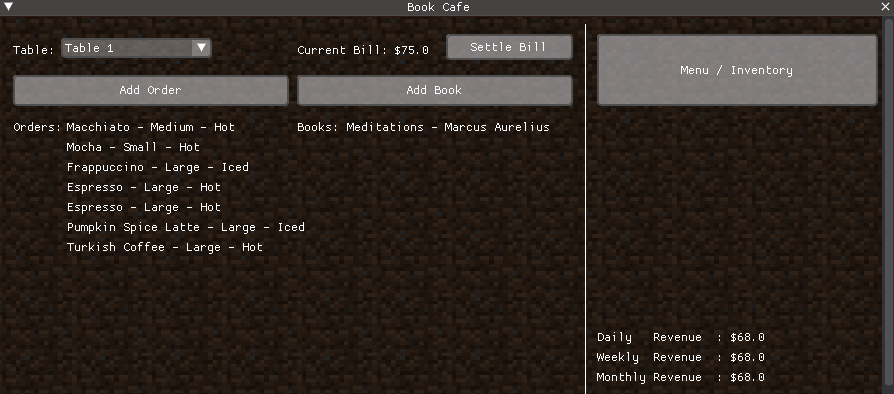
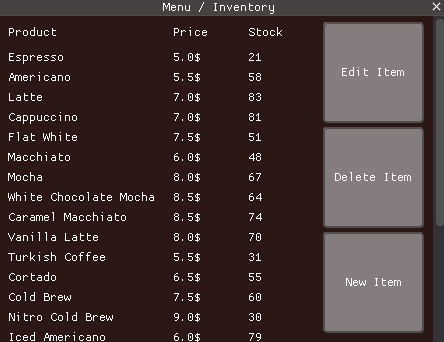
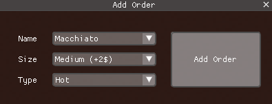
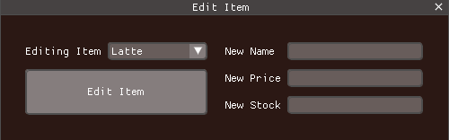

#  Book Cafe Management System (OOP Group Project)

This is a GUI-based desktop application we developed for our Object-Oriented Programming (OOP) course. It simulates a management system for a "Book Cafe" where customers can order coffee/drinks or purchase books while sitting at specific tables.

We built the interface using **Dear PyGui** and managed data persistence using local text files.

## What it does?
* **Table Management:** You can select a table, add items, and settle the bill independently for each table.
* **Order System:**
  * **Drinks:** Supports sizes (Small, Medium, Large) and types (Hot/Iced). Prices update automatically based on selection.
  * **Books:** Allows adding books to the bill with Author and Price info.
* **Inventory Management:** You can Add, Edit, or Delete items from the menu. The system automatically reduces stock when an order is placed.
* **Revenue Tracking:** Calculates Daily, Weekly, and Monthly revenue by reading historical data from profits.txt.

## How it Works
Since this is an OOP project, we structured the code using classes and inheritance:

* **Inheritance:** We have a parent class "product". The classes "drink" and "book" inherit from it.
  * "drink" adds extra attributes like size and type.
  * "book" adds the author attribute.
* **Class "table":** Manages the state of a specific table (calculating total bill, holding list of current items).
* **File I/O:** Instead of a complex database, we used:
  * inventory.txt: Stores menu items and stock.
  * profits.txt: Stores financial history (Day/Year format).

## How to Run

You need Python and the dearpygui library installed.

### 1. Install the GUI framework:
```bash
   pip install dearpygui
```
### 2. Run the application:
```bash
   python main.py
```
> Note: Make sure inventory.txt and profits.txt are in the same folder as the script. Also, the code looks for a background image named "Dirt_background.png".

## Data Structure used

**Inventory (inventory.txt):**
```text
Espresso,5.0,23
Latte,7.0,83
Frappuccino,9.5,50
```
(Format: Name, Price, Stock)

**Profits (profits.txt):**
```text
352/25,412.0
341/25,10.0
```
(Format: DayOfYear/Year, ProfitAmount)


## Screenshots








